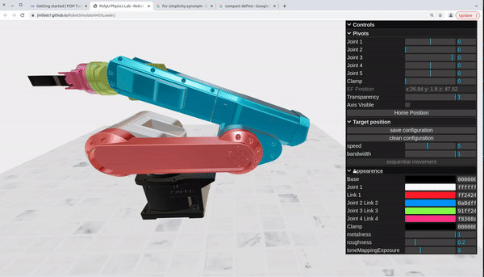

## Overview
 
POP is an online educational platform developed by the [ROMI Lab](https://www.romi-lab.org/) at The Hong Kong Polytechnic University ([PolyU](https://www.polyu.edu.hk/)). Currently, POP consists of four simulations of canonical dynamic systems in robotics and control, with a strong emphasis on interactive learning. POP is inspired by many open-source robotics simulation platforms such as [Drake](https://drake.mit.edu/) and [Webots](https://cyberbotics.com/). As it is designed specifically for online undergraduate education, we strive to make it **ready-to-use**, **interactive** and **informative**. 

**Ready-to-use** means that students can access the simulations without any package installation or environment configuration, which can be a nightmare for beginners. To this end, POP is developed to be a purely web-based project, which is accessible through modern browsers on PCs, mobiles and tablets. As an educational project, we believe one of the best ways to understand the essence of the theories in robotics and control is through controllable and repeatable **interactions** with dynamic systems. To make it possible, we build the POP simulations in which system dynamics are programmed precisely accroding to the governing physical equations. Critical terms in these equations such as controller parameters, robot joint configurations, and spring stiffness can be altered by students through an interative user interface. As for the last attribute **informative**, it refers to this tutorial per se. POP tutorials not only provide instructions on how use the developed simulations, but also try to present a consise introduction to the background knowledge of each topic. The reference material and supplementary materials are also included at the end.

POP is still at a preliminary stage. The source code is mainly written in JavaScript and is available on corresponding Github [repos](https://github.com/JinliBot7?tab=repositories). Open-source contributions are highly welcomed! The web-based 3D simulations in POP are based on [Threejs](https://threejs.org/). If you are a complete newbie, don't worry, check out this step-by-step [tutorial](https://threejs-journey.com/).

---
## View point control
 
In this section, we introduce how to navigate in POP. You can use the [robot](https://jinlibot7.github.io/RobotSimulatorWithLoader/) simulator as an example.

- **Rotate**: Press and hold Left Mouse Button (**LMB**) + Drag.
- **Translate**: Press and hold **Ctrl** + Press and hold **LMB** + Drag.
- **Zoom in/out**: Roll the mouse wheel.
- **Reset**: Press **F5**.

---
## User interface

In this section, we introduce how to use the User Interface (UI) to interact with the simulation. You can use "**Ctrl**" and "**+**" to increase the font size and vice versa.

- **Number controller** consists of a sliding bar and a text input field. It allows the user to change a parameter of the dynamic system or control input.

- **Text container** shows the **varying** system states and the magnitude of control input. Usually, it is not editable.

- **Event box** switches between two system status.

- **Button** triggers a specific event.

- **UI folders** are sometimes folded.

The POP UI is developed based on [lil-gui](https://github.com/georgealways/lil-gui).

